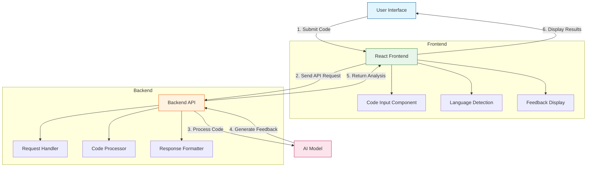

# AI Code Reviewer - Frontend

A modern web application that provides AI-powered code reviews for multiple programming languages. The frontend is built with React, TypeScript, Vite, and Tailwind CSS.

## Architecture



### Key Components

1. **Frontend (React + TypeScript)**
   - Code input with syntax highlighting
   - Real-time language detection
   - Responsive feedback display
   - Error handling and loading states

2. **Backend API**
   - RESTful API endpoints
   - Request validation
   - Integration with AI services
   - Response formatting

3. **AI Processing**
   - Code analysis
   - Security vulnerability detection
   - Best practices suggestions
   - Performance optimization tips

## 🌟 Features

- **Multi-language Support**: Detects and reviews code in various programming languages including:
  - TypeScript/JavaScript
  - Python
  - Java
  - C++
  - Rust
  - Solidity
  - Go
  - And more...
- **Smart Language Detection**: Automatically identifies the programming language of your code
- **Beautiful UI**: Clean and responsive interface with syntax highlighting
- **Real-time Feedback**: Get instant code review feedback
- **Modern Tech Stack**: Built with the latest web technologies

## 🚀 Getting Started

### Prerequisites

- Node.js 16+ and npm/yarn
- Backend server running (see backend README for setup)

### Installation

1. Clone the repository:
   ```bash
   git clone https://github.com/yourusername/ai-code-reviewer.git
   cd ai-code-reviewer/frontend
   ```

2. Install dependencies:
   ```bash
   npm install
   # or
   yarn
   ```

3. Create a `.env` file in the frontend directory with your configuration:
   ```env
   VITE_API_URL=http://localhost:9008
   ```

4. Start the development server:
   ```bash
   npm run dev
   # or
   yarn dev
   ```

5. Open [http://localhost:5173](http://localhost:5173) in your browser.

## 🛠️ Tech Stack

- **Frontend Framework**: React 18
- **Language**: TypeScript
- **Build Tool**: Vite
- **Styling**: Tailwind CSS
- **Icons**: React Icons
- **Code Highlighting**: Prism.js
- **HTTP Client**: Axios
- **State Management**: React Context API

## 📁 Project Structure

```
frontend/
├── src/
│   ├── components/     # Reusable UI components
│   ├── utils/          # Utility functions and helpers
│   ├── App.tsx         # Main application component
│   ├── main.tsx        # Application entry point
│   └── index.css       # Global styles
├── public/             # Static assets
├── index.html          # Main HTML template
└── package.json        # Dependencies and scripts
```

## 🤝 Contributing

1. Fork the repository
2. Create your feature branch (`git checkout -b feature/amazing-feature`)
3. Commit your changes (`git commit -m 'Add some amazing feature'`)
4. Push to the branch (`git push origin feature/amazing-feature`)
5. Open a Pull Request

## 📄 License

This project is licensed under the MIT License - see the [LICENSE](LICENSE) file for details.

## 🙏 Acknowledgments

- Built with ❤️ by [Your Name]
